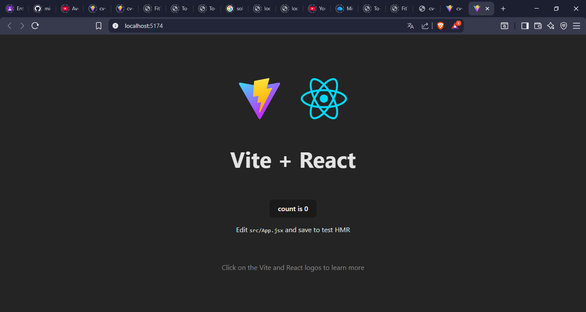
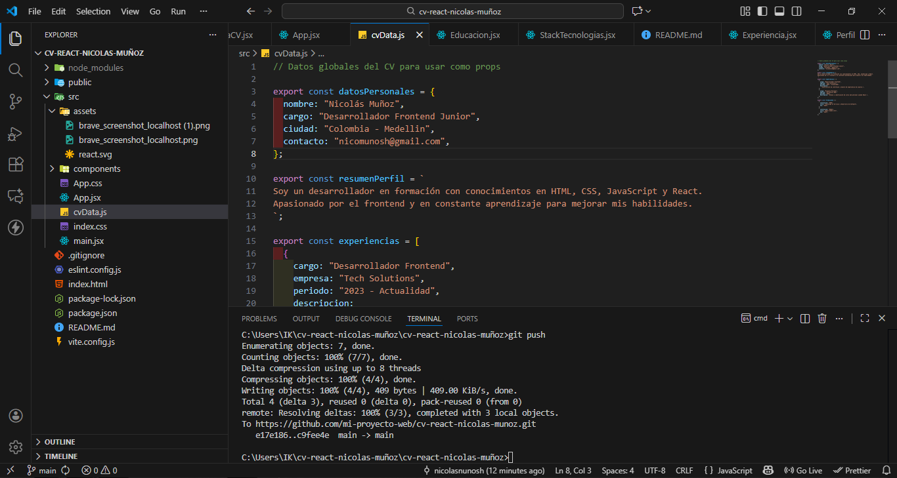
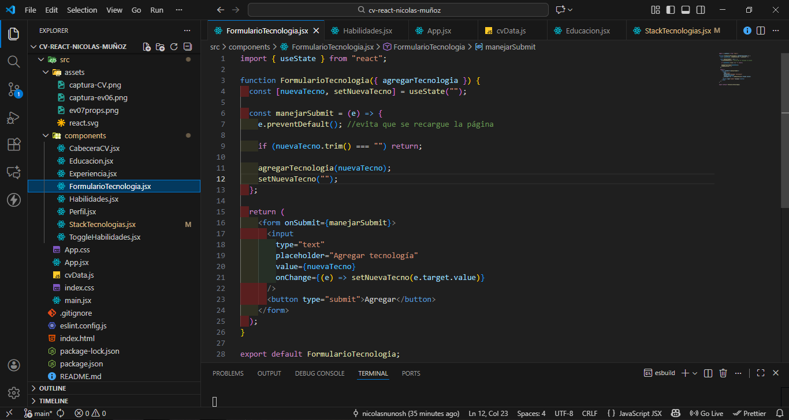
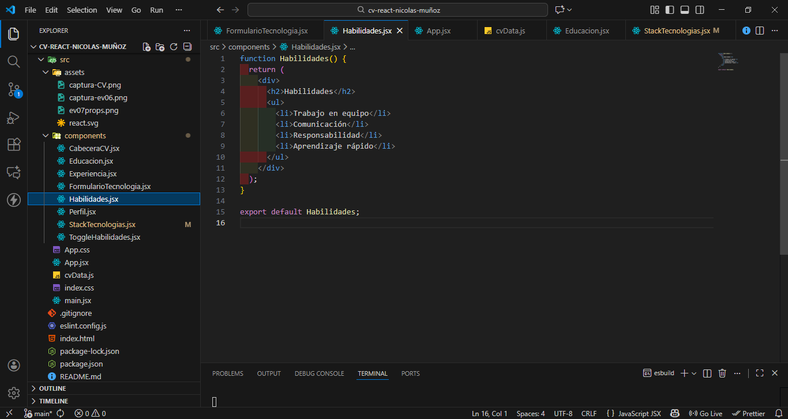
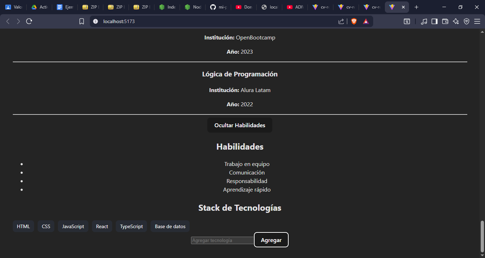
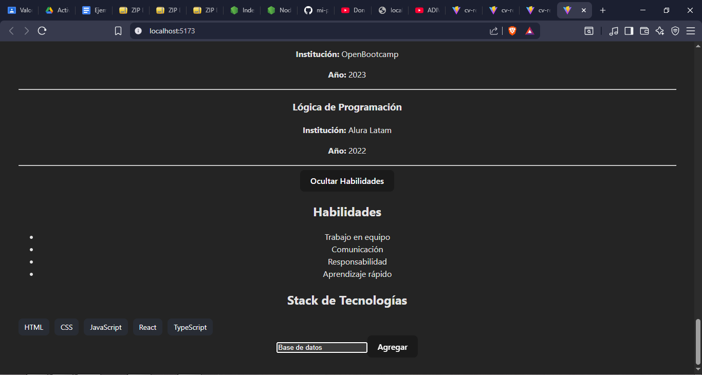

CV README – EV04: Construcción Inicial del CV en React
Evidencia GA1-220501096-03-AA1-EV04

Aprendiz: Nicolás Muñoz
Programa: Análisis y Desarrollo de Software – SENA
Actividad: EV04 – Laboratorio Inicial con React + Vite
Tema: Creación de la estructura base del CV con componentes

1. Descripción de la Evidencia

En esta evidencia se construyó la estructura inicial del proyecto de hoja de vida digital utilizando React y Vite.
El objetivo principal consistió en:

Crear los componentes base del CV.

Organizar adecuadamente la carpeta src/components.

Integrar los componentes en el archivo principal App.jsx.

Gestionar el avance mediante Git y GitHub, realizando un commit por componente creado.

Esta actividad constituye el fundamento para las evidencias posteriores: EV05, EV06, EV07 y EV08, donde el proyecto evoluciona con contenido dinámico, props, estados y eventos.

2. Configuración del Proyecto
   2.1 Clonar el repositorio
   git clone <URL-DE-TU-REPOSITORIO>

2.2 Ingresar al proyecto
cd cv-react-nicolas-munoz

2.3 Instalar dependencias
npm install

2.4 Ejecutar el servidor de desarrollo
npm run dev

Acceder desde el navegador:

👉 http://localhost:5173/

3. Componentes creados en la EV04

Durante esta evidencia se implementaron los siguientes componentes base:

3.1 CabeceraCV.jsx

Incluye la información principal del encabezado del CV: nombre, cargo, ubicación y datos de contacto.

3.2 Perfil.jsx

Contiene una breve descripción profesional y una lista inicial de habilidades generales.

3.3 Experiencia.jsx

Presenta cuatro experiencias laborales o proyectos formativos (reales o académicos).

3.4 Educacion.jsx

Incluye formación académica, cursos, instituciones y años correspondientes.

3.5 App.jsx

Archivo raíz donde se importan y renderizan todos los componentes anteriores, formando la primera versión funcional del CV.

4. Captura del Resultado (EV04)

Se incluye evidencia visual del proyecto ejecutándose en el navegador:

5. Commits realizados en la EV04

Los avances se documentaron mediante los siguientes commits:

feat: componente CabeceraCV creado

feat: componente Perfil añadido

feat: componente Experiencia agregado

feat: componente Educación implementado

feat: integración inicial de componentes en App.jsx

docs: añadido README correspondiente a EV04

6. Estado del Proyecto en EV04

Al finalizar esta evidencia, el proyecto cuenta con:

Estructura base construida en React + Vite

Componentes organizados correctamente en /src/components

Primera versión funcional del CV

Control de versiones correcto mediante commits descriptivos en GitHub

7. Conclusión de la EV04

La evidencia EV04 permitió comprender y aplicar los fundamentos iniciales del desarrollo con React, entre ellos:

Creación y uso de componentes funcionales

Manejo básico de JSX y estructura modular

Integración y renderizado desde el componente principal

Uso adecuado de Git y GitHub para versionar el proyecto

Este trabajo constituye el punto de partida para continuar con estructuras más avanzadas y dinámicas en las siguientes evidencias (EV05, EV06, EV07 y EV08).
Proyecto: CV en React – Actividad

README – EV05: Construcción de un CV Modular en React

1. Descripción de la Evidencia

Esta evidencia consiste en crear la primera versión del CV digital utilizando React y la estructura de componentes.
El objetivo es modularizar el contenido del CV en secciones independientes, organizarlas en src/components, y renderizarlas desde App.jsx.

Este avance es la base del proyecto que continuará en las evidencias EV06, EV07 y EV08.

2. Componentes creados (Punto 3.4)

Durante esta evidencia se implementaron los siguientes componentes base:

2.1 CabeceraCV.jsx

Incluye:

Nombre completo

Rol o título profesional

Ciudad

Teléfono y correo
Commit: feat: componente CabeceraCV con datos personales actualizados

2.2 Perfil.jsx

Incluye:

Descripción personal

Habilidades blandas iniciales
Commit: feat: componente Perfil con descripción personalizada

2.3 Experiencia.jsx

Incluye cuatro experiencias o proyectos formativos.
Cada uno contiene:

Cargo

Empresa

Año

Breve descripción
Commit: feat: componente Experiencia laboral creado

2.4 Educacion.jsx

Contiene:

Cursos

Programas

Instituciones

Años
Commit: feat: componente Educacion agregado

2.5 Habilidades.jsx

Lista de habilidades técnicas principales.
Commit: feat: componente Habilidades integrado

3. Integración de componentes en App.jsx
   import CabeceraCV from "./components/CabeceraCV";
   import Perfil from "./components/Perfil";
   import Experiencia from "./components/Experiencia";
   import Educacion from "./components/Educacion";
   import Habilidades from "./components/Habilidades";

function App() {
return (
<>
<CabeceraCV />
<Perfil />
<Experiencia />
<Educacion />
<Habilidades />
</>
);
}

export default App;

4. Ejecución del proyecto
   Instalar dependencias:
   npm install

Ejecutar servidor:
npm run dev

Acceder en el navegador:
👉 http://localhost:5173/

5. Captura del resultado
   

6. Commits realizados en la EV05

feat: componente CabeceraCV con datos personales actualizados

feat: componente Perfil con descripción personalizada

feat: componente Experiencia laboral creado

feat: componente Educación agregado

feat: componente Habilidades integrado

docs: README EV05 agregado

7. Conclusión

Esta evidencia permitió crear la base del CV digital aplicando conceptos fundamentales de React:

Creación de componentes funcionales

Organización modular del proyecto

Integración de componentes en App.jsx

Uso de Git y GitHub para control de versiones

Con este avance se da paso a las siguientes evidencias donde se implementará contenido dinámico (EV06), props y desestructuración (EV07), así como manejo de estados y eventos (EV08).

EV06 – Componentes dinámicos y renderizado condicional en React

En esta actividad se implementaron componentes dinámicos en React utilizando:

Renderizado de listas mediante map()

Renderizado condicional mediante funciones lógicas

Arreglos de datos estructurados

Buenas prácticas de organización de componentes

Componentes creados en EV06

1. Experiencia.jsx (Dinámico)

Contiene 10 experiencias laborales o proyectos.

Cada elemento incluye cargo, empresa, año y funciones.

Renderizado automático con map().

2. Educacion.jsx (Dinámico)

Lista de cursos, estudios y formación complementaria.

10 elementos renderizados desde un array.

3. StackTecnologias.jsx (Dinámico + Condicional)

Lista de tecnologías representadas con “etiquetas”.

Cada tecnología muestra un color diferente según su nombre.

Se usó una función condicional getColor() para asignar colores.

Captura componente dinamico y renderizado

EV07 – Reutilización de Componentes en React

Props y Desestructuración con un CV Dinámico

Descripción de la Actividad

En esta evidencia se refactorizó el proyecto cv-react-nicolas-munoz para implementar componentes reutilizables, usar props para pasar datos y aplicar desestructuración dentro de cada componente.

Los datos globales del CV se movieron al archivo cvData.js, desde donde son enviados hacia los componentes por medio de props.
Esto permite una estructura modular, escalable y fácil de mantener.

Objetivos Cumplidos

1. Extracción de datos en cvData.js

Se creó el archivo que contiene:

datosPersonales

perfil

experiencias

educacion

tecnologías iniciales (para EV08)

2. Envío de datos por props a los componentes

Los componentes:

CabeceraCV

Perfil

Experiencia

Educacion

reciben los datos desde App.jsx por medio de props.

Ejemplo:

<CabeceraCV
  nombre={datosPersonales.nombre}
  cargo={datosPersonales.cargo}
  ciudad={datosPersonales.ciudad}
  contacto={datosPersonales.contacto}
/>

3. Desestructuración de props

Dentro de cada componente se utiliza:

function CabeceraCV({ nombre, cargo, ciudad, contacto })

Esto mejora la legibilidad y evite escribir props.nombre, props.cargo, etc.

4. Renderizado dinámico de listas

Los componentes Educacion y Experiencia utilizan .map() para mostrar todos los datos enviados desde App.jsx.

Cumple completamente los requisitos de la evidencia EV07.
Estructura del Proyecto para EV07
src/
└── components/
├── CabeceraCV.jsx
├── Perfil.jsx
├── Educacion.jsx
└── Experiencia.jsx

src/cvData.js
src/App.jsx

Capturas (EV07)

Descripción Imagen
Vista del CV mostrando datos enviados por props

Vista del componente con desestructuración funcionando

Lista de experiencia dinámica
Cómo Ejecutar el Proyecto

Instalar dependencias:

npm install

Ejecutar:

npm run dev

Abrir en el navegador:

http://localhost:5173

Commits Realizados (según la guía)

refactor: extracción de datos personales en App.jsx

feat: componente CabeceraCV ahora recibe props

feat: desestructuración de props en CabeceraCV

feat: componente Perfil dinámico con props

feat: Experiencia mapeada desde arreglo en App.jsx

feat: componente Educación con props y desestructuración

docs: actualización del README con explicación del uso de props

Conclusión

Con esta evidencia se logró:

Modularizar el CV

Usar props correctamente

Aplicar desestructuración para componentes más limpios

Renderizar datos desde un archivo central

Esto establece la base para un proyecto escalable y profesional.

EV08 – Eventos y Estado Local en React

CV Dinámico con Interactividad

Descripción de la Actividad

En esta evidencia se implementaron funcionalidades interactivas dentro del proyecto cv-react-nicolas-munoz, aplicando eventos, estado local (useState), renderizado condicional, props y comunicación entre componentes.

Se agregaron dos componentes nuevos:

ToggleHabilidades → Permite mostrar/ocultar la sección de habilidades mediante un botón.

FormularioTecnologia → Permite agregar nuevas tecnologías dinámicamente al stack tecnológico del CV.

Además, App.jsx fue modificado para:

Manejar el estado global de las tecnologías.

Pasar funciones y valores mediante props a los componentes hijos.

Integrar el renderizado dinámico del stack.

Mantener el proyecto modular y escalable.

Funcionalidades Implementadas

1. Renderizado Condicional

El componente ToggleHabilidades usa useState para controlar si se muestra o no la sección de habilidades:

Botón "Mostrar habilidades"

Botón "Ocultar habilidades"

2. Manejo de Estado Global con useState

En App.jsx se guarda la lista de tecnologías usando:

const [tecnologias, setTecnologias] = useState(tecnologiasIniciales);

3. Formulario Controlado

El componente FormularioTecnologia permite:

Capturar el input del usuario

Validar que no esté vacío

Agregar la tecnología a la lista

4. Renderizado Dinámico de Listas

El componente StackTecnologias usa .map() para mostrar todas las tecnologías, incluyendo las agregadas por el usuario.

Estructura del Proyecto (solo componentes de EV08)
src/
└── components/
├── CabeceraCV.jsx
├── Perfil.jsx
├── Educacion.jsx
├── Experiencia.jsx
├── StackTecnologias.jsx
├── ToggleHabilidades.jsx <- (nuevo)
└── FormularioTecnologia.jsx <- (nuevo)

src/cvData.js
src/App.jsx

Capturas

Agregar-ocultar

[EV08](src/assets/evo08agregar-ocultar.png)

Habilidades

Formulario

Tecnología agregada

Cómo Ejecutar el Proyecto

Instalar dependencias:

npm install

Iniciar el servidor:

npm run dev

Abrir en el navegador:

http://localhost:5173

Commits Realizados

Los commits obligatorios según la guía EV08 fueron realizados:

chore: organización inicial del proyecto para integración de eventos

feat: creación de componente ToggleHabilidades con renderizado condicional

feat: implementación de useState para mostrar/ocultar habilidades

feat: creación de componente FormularioTecnologia con inputs controlados

feat: función agregarTecnologia en App.jsx y paso como prop

feat: renderizado dinámico de tecnologías desde estado

docs: README del EV08 actualizado con evidencia

Conclusión

Con esta evidencia se implementaron las bases del comportamiento interactivo en React:

Estado local

Formularios controlados

Renderizado condicional

Comunicación Padre → Hijo mediante props

Esto convierte el CV en una herramienta dinámica, escalable e interactiva.
