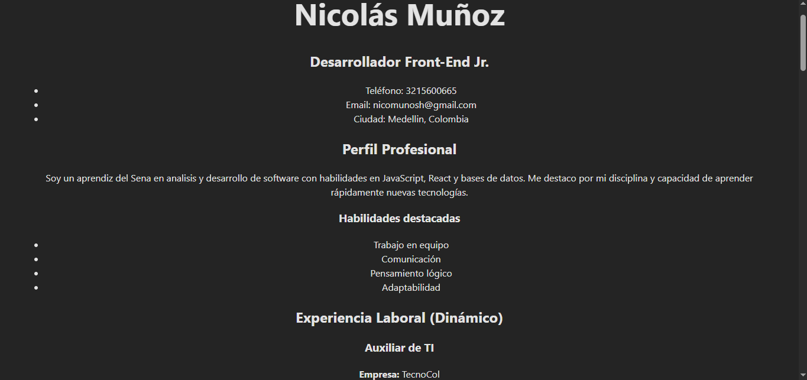
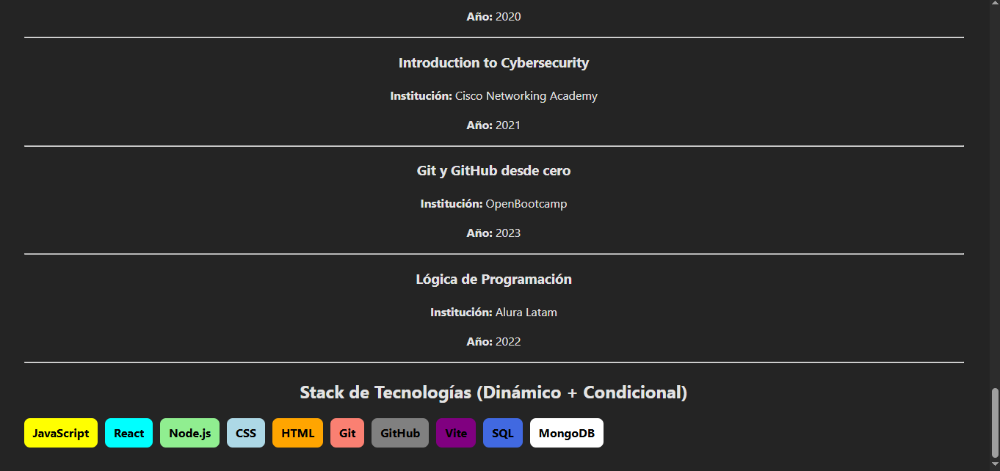

Proyecto: CV en React – Actividad 3.4

Este proyecto corresponde al desarrollo del currículo (CV) modularizado utilizando componentes de React, siguiendo las instrucciones de la guía 2 – Punto 3.4: Implementación de componentes.

El objetivo del ejercicio es estructurar un CV a través de componentes reutilizables, organizados en carpetas y vinculados en el componente principal App.jsx.

Componentes creados en el punto 3.4

Durante esta actividad se crearon los siguientes componentes dentro de la carpeta src/components/:

1. CabeceraCV.jsx

Contiene nombre, rol y datos personales básicos.

2. Perfil.jsx

Incluye una breve descripción profesional y habilidades blandas destacadas.

3. Experiencia.jsx

Registra experiencias laborales previas.

4. Educacion.jsx

Describe la formación académica realizada.

5. Habilidades.jsx

Lista habilidades técnicas y competencias personales relevantes.

Continuar componiendo Proyectos, Contacto y Footer en caso de necesitarse más adelante.

Integración en App.jsx

Todos los componentes fueron importados en App.jsx, de la siguiente manera:

import CabeceraCV from "./components/CabeceraCV";
import Perfil from "./components/Perfil";
import Experiencia from "./components/Experiencia";
import Educacion from "./components/Educacion";
import Habilidades from "./components/Habilidades";

function App() {
return (
<>
<CabeceraCV />
<Perfil />
<Experiencia />
<Educacion />
<Habilidades />
</>
);
}

export default App;

Ejecución del proyecto

Para ejecutar el proyecto en un servidor de desarrollo:

npm install
npm run dev

El proyecto se abrirá en:

http://localhost:5173/

Commits realizados en la actividad 3.4

Cada componente incluye su commit correspondiente:

feat: componente CabeceraCV con datos personales actualizados

feat: componente Perfil con descripción personalizada

feat: componente Experiencia laboral creado

feat: componente Educación agregado

feat: componente Habilidades integrado

Captura del CV

Conclusión

El punto 3.4 permitió crear una estructura modular, ordenada y mantenible del CV a través de React, siguiendo buenas prácticas de componentes y control de versiones con Git.

EV06 – Componentes dinámicos y renderizado condicional en React

En esta actividad se implementaron componentes dinámicos en React utilizando:

Renderizado de listas mediante map()

Renderizado condicional mediante funciones lógicas

Arreglos de datos estructurados

Buenas prácticas de organización de componentes

Componentes creados en EV06

1. Experiencia.jsx (Dinámico)

Contiene 10 experiencias laborales o proyectos.

Cada elemento incluye cargo, empresa, año y funciones.

Renderizado automático con map().

2. Educacion.jsx (Dinámico)

Lista de cursos, estudios y formación complementaria.

10 elementos renderizados desde un array.

3. StackTecnologias.jsx (Dinámico + Condicional)

Lista de tecnologías representadas con “etiquetas”.

Cada tecnología muestra un color diferente según su nombre.

Se usó una función condicional getColor() para asignar colores.

Captura componente dinamico y renderizado

